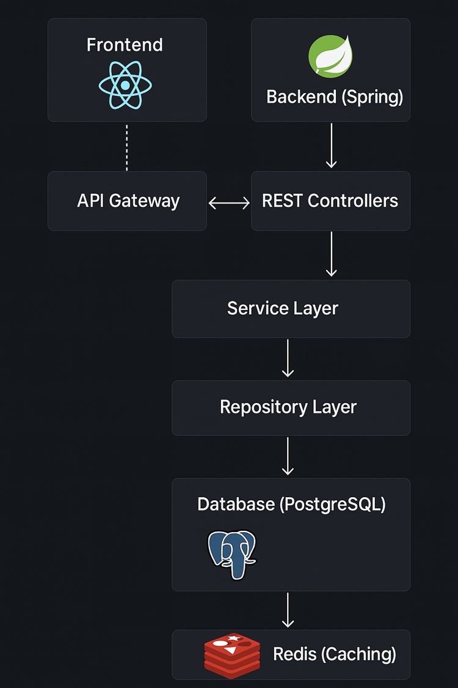
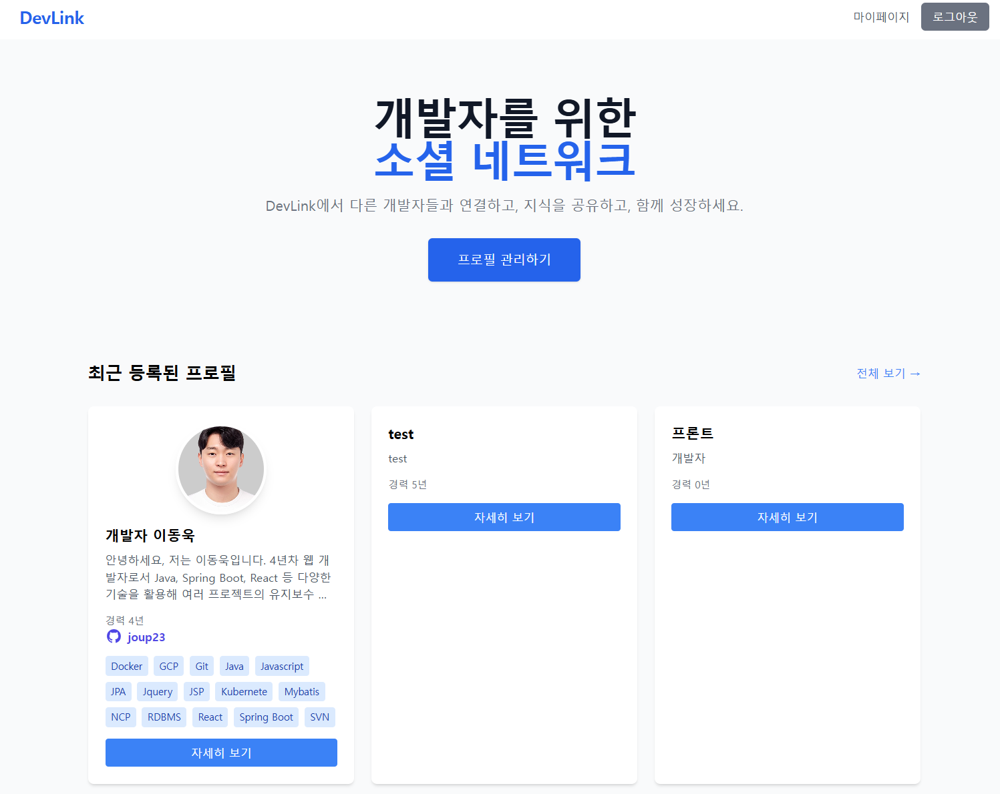
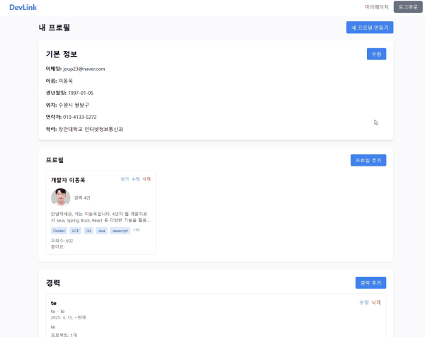
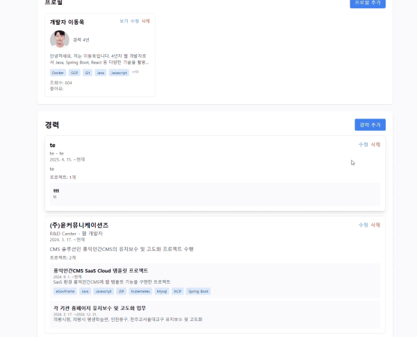
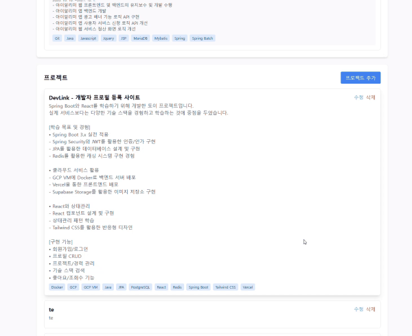
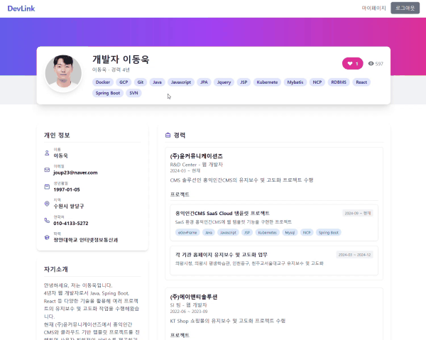

# DevLink - 개발자 포트폴리오 플랫폼

[](LICENSE)

## 개요
**DevLink**는 개발자들이 자신의 포트폴리오를 쉽게 만들고 공유할 수 있는 웹 플랫폼입니다.

> **프로젝트 기간:** 2025-01 ~ 현재  
> *Spring Boot와 React를 학습하기 위해 개발한 토이 프로젝트입니다. 실제 서비스보다는 다양한 기술 스택을 경험하고 학습하는 것에 중점을 두었습니다.*

---

## 🌟 학습 목표 및 경험
- **Spring Boot 3.x 실전 적용**
  - Spring Security와 JWT를 활용한 인증/인가 구현
  - JPA를 활용한 데이터베이스 설계 및 구현
  - Redis를 활용한 캐싱 시스템 구현 경험
- **클라우드 서비스 활용**
  - GCP VM에 Docker로 백엔드 서버 배포
  - Vercel을 통한 프론트엔드 배포
  - Supabase Storage를 활용한 이미지 저장소 구현
- **React와 상태관리**
  - React 컴포넌트 설계 및 구현
  - 상태관리 패턴 학습
  - Tailwind CSS를 활용한 반응형 디자인

---

## 🔍 주요 기능
- **프로필 관리**
  - 개인 정보 및 자기소개 작성
  - 기술 스택 관리
  - 프로필 이미지 업로드
- **프로젝트 관리**
  - 프로젝트 정보 등록
  - 프로젝트 이미지 업로드
  - GitHub 저장소 연동
  - 프로젝트 URL 관리
- **경력 관리**
  - 경력 정보 등록
  - 회사 정보 및 기간 관리
  - 직무 및 역할 설명
- **소셜 기능**
  - 프로필 좋아요
  - 조회수 통계
  - 스킬 기반 프로필 검색

---

## 🛠 기술 스택

### 백엔드
- Java 17
- Spring Boot 3.4.1
- Spring Security
- Spring Data JPA
- PostgreSQL
- Redis (캐싱)
- JWT (인증)

### 프론트엔드
- React
- Tailwind CSS
- Supabase (이미지 스토리지)
- Axios

---

## 프로젝트 구상도



---

## 🖼️ 주요 기능 스크린샷

### 📌 메인 화면


### 📌 마이페이지


### 📌 기본정보 수정


### 📌 경력 수정


### 📌 프로젝트 수정


### 📌 프로필 수정


### 📌 프로필 조회


> 📎 *위 이미지는 실제 DevLink의 구현 화면입니다.*

---

## 🚀 시작하기

### 프론트엔드 실행
```bash
cd frontend
npm install
npm run dev
```

---

## ⚙️ 환경 설정

### 백엔드
- `application.properties` 파일에서 데이터베이스 및 Redis 설정
- JWT 시크릿 키 설정

### 프론트엔드
- `.env` 파일에서 API 엔드포인트 및 Supabase 설정

---

## 🌐 배포

### 백엔드
- **Google Cloud Platform (GCP) VM 인스턴스**
  - Ubuntu 22.04 LTS
  - Docker 컨테이너화
  - Spring Boot 내장 톰캣 사용

### 프론트엔드
- **Vercel**
  - 자동 배포 (GitHub 연동)
  - CDN을 통한 정적 파일 서빙
  - 환경 변수 관리

---

## 📦 배포 프로세스

### 백엔드 배포 (GCP VM)
1. VM 인스턴스 생성 및 설정
2. Docker 설치 및 설정
3. 애플리케이션 배포 및 실행

### 프론트엔드 배포 (Vercel)
1. GitHub 저장소 연동
2. 환경 변수 설정
3. 자동 배포 설정
4. 도메인 설정

---

## 📄 라이선스
This project is licensed under the [MIT License](LICENSE).

---

